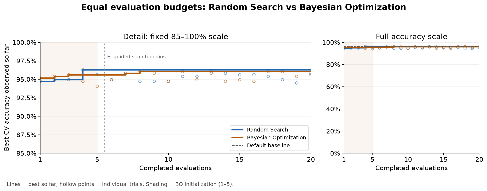

# Bayesian Optimization for Random Forest Hyperparameter Tuning

## Research Question

Under the same 20-evaluation budget, which search strategy finds a strong Random Forest configuration more efficiently?

The [executed notebook](bayesian_optimization_rf.ipynb) contains the implementation, trial histories, final results, and validation checks.

## Dataset and Model

The experiment uses scikit-learn's Breast Cancer Wisconsin classification dataset: 569 samples, 30 numeric features, and malignant/benign labels. A `RandomForestClassifier` predicts the class. The default forest provides a separate reference model. Feature scaling is unnecessary for the forest's threshold-based splits.

## Experimental Design

- One stratified **80/20 split** gives **455 training and 114 test samples**.
- Hyperparameter selection uses training data only. Held-out features are accessed after both winners are saved.
- All candidates and the baseline use the same **five-fold `StratifiedKFold` object**, with shuffling and seed **42**.
- The objective is **mean CV accuracy**. Fold standard deviation is a secondary measure of variation.
- Seed **42** controls the split, folds, forest, Random Search, and Bayesian optimizer. CV and forest fitting are serial.
- Each search receives **exactly 20 evaluations**. Bayesian initialization counts toward that budget: **5 initialization + 15 EI-guided = 20**.
- Highest unrounded CV accuracy selects each winner; exact ties retain the earliest trial. Final models read the saved selections, fit all training data, and predict the test set once each.

One evaluation means five forest fits. Including the separate baseline, each complete execution uses **205 CV fits and 3 final fits**.

## Hyperparameter Search Space

**Parameters vs hyperparameters:** split thresholds and leaf class probabilities are learned during forest fitting. Hyperparameters such as tree count, depth limit, minimum split size, and feature sampling are chosen before fitting and control how the forest learns.

| Parameter | Shared range | Rationale |
|:--|:--|:--|
| `n_estimators` | Integer 50–300 inclusive | Tests larger forests without excessive model size. |
| `max_depth` | Integer 2–20 inclusive | Covers shallow regularization through deeper trees. |
| `min_samples_split` | Integer 2–20 inclusive | Varies resistance to further splitting. |
| `max_features` | Continuous fraction 0.3–1.0 | Varies feature subsampling while retaining broad coverage. |

Both searches use identical parameter meanings. The feature fraction maps to 9–30 candidate features per split, making its effective response stepwise. The baseline's default unrestricted depth and `sqrt` feature sampling are outside this tuning space.

## Search Methods

### Random Search

An explicit seeded loop samples configurations independently of earlier scores and records every evaluation.

### Bayesian Optimization

**Observe → Model → Choose → Update** describes the search cycle. Evaluations **1–5 are random initialization**. Evaluations **6–20 use a Gaussian Process surrogate and Expected Improvement**.

The objective maps hyperparameters to mean five-fold CV accuracy. The GP approximates this relationship and supplies predictive mean and uncertainty. It uses a Matérn kernel (`nu=2.5`), range-width initial length scales, normalized targets, and `alpha=1e-6` numerical regularization. Native integer dimensions preserve parameter meaning.

Expected Improvement uses fixed **`xi=0.01`** and considers both chance and magnitude of improvement. Exploration investigates uncertain regions; exploitation favors predicted high performance. Probability of Improvement emphasizes the chance of clearing a threshold, while Upper Confidence Bound adds an uncertainty bonus to predicted value. **PI and UCB are conceptual alternatives only; no such optimization runs were conducted.**

## Results

CV SD is expressed in percentage points. Baseline runtime is its CV time; search runtime includes all 20 evaluations plus optimizer overhead. Model size is uncompressed pickle protocol 5 in decimal MB. Timings below are measurements from the final fresh-kernel verification execution.

| Model | CV accuracy | CV SD (pp) | Test accuracy | CV/search time (s) | Size (MB) |
|:--|--:|--:|:--|--:|--:|
| Baseline | 96.2637% | 1.7855 | 95.6140% (109/114) | 1.99 | 0.314 |
| Random Search | 96.2637% | 1.4906 | 95.6140% (109/114) | 65.22 | 0.561 |
| Bayesian Optimization | 96.0440% | 2.1534 | 94.7368% (108/114) | 82.56 | 0.664 |

| Model | Trees | Max depth | Min split | Feature fraction | Winning evaluation |
|:--|--:|--:|--:|:--|--:|
| Baseline | 100 | None | 2 | sqrt | — |
| Random Search | 241 | 11 | 4 | 0.615270156526897 | 4 |
| Bayesian Optimization | 298 | 15 | 4 | 0.9834624208266174 | 8 |

| Model | Tree nodes | Final fit (s) | CV evaluation time (s) | Search overhead (s) |
|:--|--:|--:|--:|--:|
| Baseline | 3,556 | 0.243 | 1.987 | 0.000 |
| Random Search | 6,135 | 0.875 | 65.179 | 0.038 |
| Bayesian Optimization | 7,212 | 1.598 | 74.662 | 7.894 |

## Convergence



The marker after evaluation 5 identifies the start of EI-guided search at evaluation 6. The fixed detail scale is accompanied by a full accuracy-scale view.

| Completed evaluations | Random Search best CV | Bayesian Optimization best CV |
|--:|--:|--:|
| 5 | 96.2637% | 95.6044% |
| 10 | 96.2637% | 96.0440% |
| 15 | 96.2637% | 96.0440% |
| 20 | 96.2637% | 96.0440% |

The Bayesian value at evaluation 5 still reflects random initialization only.

## Interpretation

### Quality

Random Search achieved the strongest tuned CV result, exceeding Bayesian Optimization by only **0.2198 percentage points**. The baseline matched Random Search in CV and test accuracy. The searches differed by **one test prediction out of 114**.

### Efficiency

Random Search found its winner at evaluation **4**, versus **8** for Bayesian Optimization, and led at all four budget checkpoints. Bayesian Optimization led at evaluations **1–3 during random initialization**, before any acquisition-guided trial. Random Search was more evaluation-efficient overall in this run.

### Reliability

The differences are small. CV variation, fixed-fold selection, and one split and seed preclude a general superiority claim. Strong defaults, broad or flat high-performing regions, and an early random discovery are plausible interpretations rather than proven causes. Only 15 Bayesian evaluations were EI-guided. A plateau does not prove that a global optimum was found.

### Practicality

Bayesian Optimization required more search time and produced the largest selected model. The default forest matched the best observed accuracy with lower complexity, smaller storage, and faster fitting. Thus the strongest tuning method and the most practical evaluated model were different choices.

## Conclusion

Under this dataset, split, seed, search space, CV procedure, metric, and 20-evaluation budget, Random Search found the stronger tuned configuration. Bayesian Optimization did not outperform it in this run. The default Random Forest was arguably the most practical evaluated model because it matched the best observed CV and test accuracy with lower cost. These findings establish no universal superiority of either search strategy.

## Reproducibility / How to Run

Verified with Python **3.11.9**, `bayesian-optimization 3.3.0`, and `scikit-learn 1.9.0`. Dependencies are pinned in `requirements.txt`.

```shell
python -m venv .venv
```

Activate with `.venv\Scripts\activate` in Windows Command Prompt or `source .venv/bin/activate` on macOS/Linux, then run from the repository root:

```shell
python -m pip install -r requirements.txt
python -m jupyterlab bayesian_optimization_rf.ipynb
```

Use **Restart Kernel and Run All Cells**. A complete execution takes a few minutes depending on hardware. For noninteractive execution:

```shell
python -m jupyter nbconvert --to notebook --execute --inplace --ExecutePreprocessor.timeout=1200 bayesian_optimization_rf.ipynb
```

The notebook regenerates `results/`. The final verification reproduced all 40 configurations, fold scores, winners, test accuracies, and model-size indicators from the original verified experiment. Assertions check budgets, initialization phases, common folds and bounds, monotonic histories, saved winners, and final refits. No additional search settings were tried. Timings vary between executions; README timings describe the submitted run.

## Limitations

One small dataset, seed, and split do not establish robustness or statistical significance. CV selection may overfit validation data. The GP approximates an irregular, partly stepwise objective, and its uncertainty differs from fold variation. Initial random designs differ between the two generators. Runtime depends on system load and execution order. Native integer support is labelled experimental by the package; warnings are recorded in `results/metrics.json`.

## References

- *Bayesian Optimization for Hyperparameter Tuning* — training material.
- [scikit-learn Breast Cancer Wisconsin dataset documentation](https://scikit-learn.org/stable/modules/generated/sklearn.datasets.load_breast_cancer.html).
- [scikit-learn RandomForestClassifier documentation](https://scikit-learn.org/stable/modules/generated/sklearn.ensemble.RandomForestClassifier.html).
- [Bayesian Optimization (`bayes_opt`) documentation](https://bayesian-optimization.github.io/BayesianOptimization/master/), including [integer dimensions](https://bayesian-optimization.github.io/BayesianOptimization/master/parameter_types.html) and [Expected Improvement](https://bayesian-optimization.github.io/BayesianOptimization/master/reference/acquisition/ExpectedImprovement.html).
